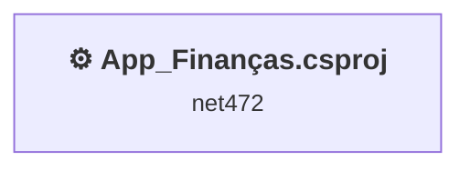
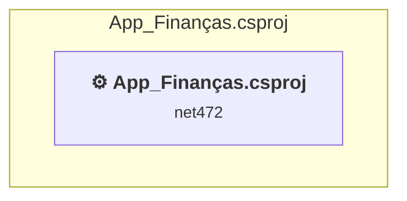

# Projects and dependencies analysis

This document provides a comprehensive overview of the projects and their dependencies in the context of upgrading to .NETCoreApp,Version=v10.0.

## Table of Contents

- [Executive Summary](#executive-Summary)
  - [Highlevel Metrics](#highlevel-metrics)
  - [Projects Compatibility](#projects-compatibility)
  - [Package Compatibility](#package-compatibility)
  - [API Compatibility](#api-compatibility)
- [Aggregate NuGet packages details](#aggregate-nuget-packages-details)
- [Top API Migration Challenges](#top-api-migration-challenges)
  - [Technologies and Features](#technologies-and-features)
  - [Most Frequent API Issues](#most-frequent-api-issues)
- [Projects Relationship Graph](#projects-relationship-graph)
- [Project Details](#project-details)

  - [App_Finanças\App_Finanças.csproj](#app_finançasapp_finançascsproj)

## Executive Summary

### Highlevel Metrics

| Metric | Count | Status |
| :--- | :---: | :--- |
| Total Projects | 1 | All require upgrade |
| Total NuGet Packages | 31 | 4 need upgrade |
| Total Code Files | 11 |  |
| Total Code Files with Incidents | 4 |  |
| Total Lines of Code | 367 |  |
| Total Number of Issues | 25 |  |
| Estimated LOC to modify | 14+ | at least 3,8% of codebase |

### Projects Compatibility

| Project | Target Framework | Difficulty | Package Issues | API Issues | Est. LOC Impact | Description |
| :--- | :---: | :---: | :---: | :---: | :---: | :--- |
| [App_Finanças\App_Finanças.csproj](#app_finançasapp_finançascsproj) | net472 | 🟢 Low | 9 | 14 | 14+ | ClassicDotNetApp, Sdk Style = False |

### Package Compatibility

| Status | Count | Percentage |
| :--- | :---: | :---: |
| ✅ Compatible | 27 | 87,1% |
| ⚠️ Incompatible | 0 | 0,0% |
| 🔄 Upgrade Recommended | 4 | 12,9% |
| ***Total NuGet Packages*** | ***31*** | ***100%*** |

### API Compatibility

| Category | Count | Impact |
| :--- | :---: | :--- |
| 🔴 Binary Incompatible | 4 | High - Require code changes |
| 🟡 Source Incompatible | 10 | Medium - Needs re-compilation and potential conflicting API error fixing |
| 🔵 Behavioral change | 0 | Low - Behavioral changes that may require testing at runtime |
| ✅ Compatible | 224 |  |
| ***Total APIs Analyzed*** | ***238*** |  |

## Aggregate NuGet packages details

| Package | Current Version | Suggested Version | Projects | Description |
| :--- | :---: | :---: | :--- | :--- |
| BCrypt.Net-Next | 4.0.3 |  | [App_Finanças.csproj](#app_finançasapp_finançascsproj) | ✅Compatible |
| BouncyCastle.Cryptography | 2.6.1 |  | [App_Finanças.csproj](#app_finançasapp_finançascsproj) | ✅Compatible |
| MailKit | 4.14.1 |  | [App_Finanças.csproj](#app_finançasapp_finançascsproj) | ✅Compatible |
| Microsoft.Bcl.AsyncInterfaces | 10.0.3 |  | [App_Finanças.csproj](#app_finançasapp_finançascsproj) | ✅Compatible |
| Microsoft.Bcl.TimeProvider | 8.0.1 | 10.0.3 | [App_Finanças.csproj](#app_finançasapp_finançascsproj) | Recomenda-se a atualização do pacote NuGet |
| Microsoft.Extensions.Configuration | 10.0.3 |  | [App_Finanças.csproj](#app_finançasapp_finançascsproj) | ✅Compatible |
| Microsoft.Extensions.Configuration.Abstractions | 10.0.3 |  | [App_Finanças.csproj](#app_finançasapp_finançascsproj) | ✅Compatible |
| Microsoft.Extensions.Configuration.FileExtensions | 10.0.3 |  | [App_Finanças.csproj](#app_finançasapp_finançascsproj) | ✅Compatible |
| Microsoft.Extensions.Configuration.Json | 10.0.3 |  | [App_Finanças.csproj](#app_finançasapp_finançascsproj) | ✅Compatible |
| Microsoft.Extensions.FileProviders.Abstractions | 10.0.3 |  | [App_Finanças.csproj](#app_finançasapp_finançascsproj) | ✅Compatible |
| Microsoft.Extensions.FileProviders.Physical | 10.0.3 |  | [App_Finanças.csproj](#app_finançasapp_finançascsproj) | ✅Compatible |
| Microsoft.Extensions.FileSystemGlobbing | 10.0.3 |  | [App_Finanças.csproj](#app_finançasapp_finançascsproj) | ✅Compatible |
| Microsoft.Extensions.Logging.Abstractions | 2.1.0 | 10.0.3 | [App_Finanças.csproj](#app_finançasapp_finançascsproj) | Recomenda-se a atualização do pacote NuGet |
| Microsoft.Extensions.Primitives | 10.0.3 |  | [App_Finanças.csproj](#app_finançasapp_finançascsproj) | ✅Compatible |
| Microsoft.IdentityModel.Abstractions | 8.15.0 |  | [App_Finanças.csproj](#app_finançasapp_finançascsproj) | ✅Compatible |
| Microsoft.IdentityModel.JsonWebTokens | 8.15.0 |  | [App_Finanças.csproj](#app_finançasapp_finançascsproj) | ✅Compatible |
| Microsoft.IdentityModel.Logging | 8.15.0 |  | [App_Finanças.csproj](#app_finançasapp_finançascsproj) | ✅Compatible |
| Microsoft.IdentityModel.Tokens | 8.15.0 |  | [App_Finanças.csproj](#app_finançasapp_finançascsproj) | ✅Compatible |
| MimeKit | 4.14.0 |  | [App_Finanças.csproj](#app_finançasapp_finançascsproj) | ✅Compatible |
| System.Buffers | 4.6.1 |  | [App_Finanças.csproj](#app_finançasapp_finançascsproj) | A funcionalidade do pacote NuGet está incluída na referência da estrutura |
| System.Diagnostics.DiagnosticSource | 6.0.2 | 10.0.3 | [App_Finanças.csproj](#app_finançasapp_finançascsproj) | Recomenda-se a atualização do pacote NuGet |
| System.Formats.Asn1 | 8.0.1 | 10.0.3 | [App_Finanças.csproj](#app_finançasapp_finançascsproj) | Recomenda-se a atualização do pacote NuGet |
| System.IdentityModel.Tokens.Jwt | 8.15.0 |  | [App_Finanças.csproj](#app_finançasapp_finançascsproj) | ✅Compatible |
| System.IO.Pipelines | 10.0.3 |  | [App_Finanças.csproj](#app_finançasapp_finançascsproj) | ✅Compatible |
| System.Memory | 4.6.3 |  | [App_Finanças.csproj](#app_finançasapp_finançascsproj) | A funcionalidade do pacote NuGet está incluída na referência da estrutura |
| System.Numerics.Vectors | 4.6.1 |  | [App_Finanças.csproj](#app_finançasapp_finançascsproj) | A funcionalidade do pacote NuGet está incluída na referência da estrutura |
| System.Runtime.CompilerServices.Unsafe | 6.1.2 |  | [App_Finanças.csproj](#app_finançasapp_finançascsproj) | ✅Compatible |
| System.Text.Encodings.Web | 10.0.3 |  | [App_Finanças.csproj](#app_finançasapp_finançascsproj) | ✅Compatible |
| System.Text.Json | 10.0.3 |  | [App_Finanças.csproj](#app_finançasapp_finançascsproj) | ✅Compatible |
| System.Threading.Tasks.Extensions | 4.6.3 |  | [App_Finanças.csproj](#app_finançasapp_finançascsproj) | A funcionalidade do pacote NuGet está incluída na referência da estrutura |
| System.ValueTuple | 4.6.1 |  | [App_Finanças.csproj](#app_finançasapp_finançascsproj) | A funcionalidade do pacote NuGet está incluída na referência da estrutura |

## Top API Migration Challenges

### Technologies and Features

| Technology | Issues | Percentage | Migration Path |
| :--- | :---: | :---: | :--- |
| Legacy Configuration System | 10 | 71,4% | Legacy XML-based configuration system (app.config/web.config) that has been replaced by a more flexible configuration model in .NET Core. The old system was rigid and XML-based. Migrate to Microsoft.Extensions.Configuration with JSON/environment variables; use System.Configuration.ConfigurationManager NuGet package as interim bridge if needed. |
| IdentityModel & Claims-based Security | 4 | 28,6% | Windows Identity Foundation (WIF), SAML, and claims-based authentication APIs that have been replaced by modern identity libraries. WIF was the original identity framework for .NET Framework. Migrate to Microsoft.IdentityModel.* packages (modern identity stack). |

### Most Frequent API Issues

| API | Count | Percentage | Category |
| :--- | :---: | :---: | :--- |
| T:System.Configuration.ConfigurationManager | 5 | 35,7% | Source Incompatible |
| P:System.Configuration.ConfigurationManager.AppSettings | 5 | 35,7% | Source Incompatible |
| M:System.IdentityModel.Tokens.Jwt.JwtSecurityTokenHandler.WriteToken(Microsoft.IdentityModel.Tokens.SecurityToken) | 1 | 7,1% | Binary Incompatible |
| M:System.IdentityModel.Tokens.Jwt.JwtSecurityTokenHandler.CreateToken(Microsoft.IdentityModel.Tokens.SecurityTokenDescriptor) | 1 | 7,1% | Binary Incompatible |
| T:System.IdentityModel.Tokens.Jwt.JwtSecurityTokenHandler | 1 | 7,1% | Binary Incompatible |
| M:System.IdentityModel.Tokens.Jwt.JwtSecurityTokenHandler.#ctor | 1 | 7,1% | Binary Incompatible |

## Projects Relationship Graph

Legend:
📦 SDK-style project
⚙️ Classic project

## Project Details

### App_Finanças\App_Finanças.csproj

#### Project Info

- **Current Target Framework:** net472
- **Proposed Target Framework:** net10.0
- **SDK-style**: False
- **Project Kind:** ClassicDotNetApp
- **Dependencies**: 0
- **Dependants**: 0
- **Number of Files**: 12
- **Number of Files with Incidents**: 4
- **Lines of Code**: 367
- **Estimated LOC to modify**: 14+ (at least 3,8% of the project)

#### Dependency Graph

Legend:
📦 SDK-style project
⚙️ Classic project

### API Compatibility

| Category | Count | Impact |
| :--- | :---: | :--- |
| 🔴 Binary Incompatible | 4 | High - Require code changes |
| 🟡 Source Incompatible | 10 | Medium - Needs re-compilation and potential conflicting API error fixing |
| 🔵 Behavioral change | 0 | Low - Behavioral changes that may require testing at runtime |
| ✅ Compatible | 224 |  |
| ***Total APIs Analyzed*** | ***238*** |  |

#### Project Technologies and Features

| Technology | Issues | Percentage | Migration Path |
| :--- | :---: | :---: | :--- |
| IdentityModel & Claims-based Security | 4 | 28,6% | Windows Identity Foundation (WIF), SAML, and claims-based authentication APIs that have been replaced by modern identity libraries. WIF was the original identity framework for .NET Framework. Migrate to Microsoft.IdentityModel.* packages (modern identity stack). |
| Legacy Configuration System | 10 | 71,4% | Legacy XML-based configuration system (app.config/web.config) that has been replaced by a more flexible configuration model in .NET Core. The old system was rigid and XML-based. Migrate to Microsoft.Extensions.Configuration with JSON/environment variables; use System.Configuration.ConfigurationManager NuGet package as interim bridge if needed. |

